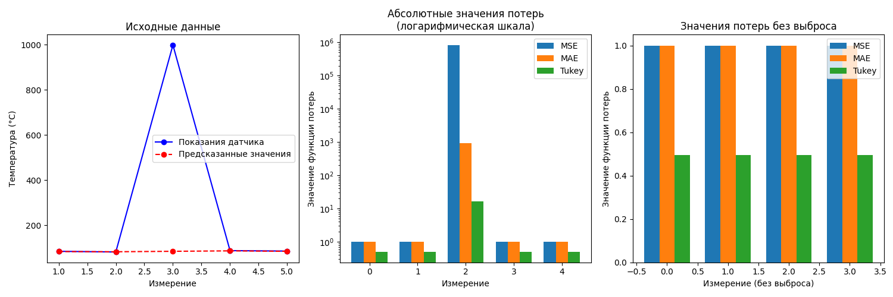

# Функции потерь в задачах машинного обучения

## Введение

Функция потерь является ключевым компонентом в обучении моделей машинного обучения, определяющим не только качество обучения, но и способность модели к обобщению на новых данных. В задачах регрессии выбор функции потерь особенно критичен, так как он влияет на следующие аспекты:

1. **Обработка ошибок разного масштаба**
   - Способность функции различать и по-разному обрабатывать малые и большие отклонения
   - Возможность настройки чувствительности к ошибкам разного масштаба

2. **Устойчивость к выбросам**
   - Способность функции минимизировать влияние аномальных значений
   - Баланс между точностью и робастностью

3. **Эффективность оптимизации**
   - Влияние на скорость сходимости алгоритмов оптимизации
   - Наличие и характер локальных минимумов

4. **Интерпретируемость**
   - Простота понимания получаемых результатов
   - Возможность сравнения качества разных моделей

## Основные функции потерь

### Обозначения
- $n$: количество примеров в выборке
- $y_i$: истинное значение для i-го примера
- $ŷ_i$: предсказанное значение для i-го примера

### 1. Среднеквадратичная ошибка (MSE)

MSE имеет глубокое статистическое обоснование, связанное с методом максимального правдоподобия при предположении о нормальном распределении ошибок. Если рассматривать задачу регрессии как оценку условного математического ожидания $\mathbb{E}(Y|X)$, то MSE является оптимальной функцией потерь. Квадратичная форма функции следует из свойств нормального распределения и принципа максимизации энтропии. При минимизации MSE мы фактически решаем задачу поиска несмещенной оценки с минимальной дисперсией, что напрямую связано с теоремой Гаусса-Маркова в линейной регрессии.

**Формула:**
$$ \text{MSE} = \frac{1}{n} \sum_{i=1}^{n} (y_i - \hat{y}_i)^2 $$

**Характеристики:**
- Сильно штрафует большие отклонения из-за квадратичной зависимости
- Обеспечивает стабильную оптимизацию для линейных моделей
- Чувствительна к выбросам
- Наиболее эффективна в задачах, где большие ошибки недопустимы

**Применение:** Финансовое прогнозирование, предсказание цен

**Ситуация**: Агентство недвижимости разрабатывает модель для оценки стоимости квартир в центре города. Ошибка в 1 миллион рублей для квартиры стоимостью 5 миллионов гораздо критичнее, чем такая же ошибка для квартиры за 20 миллионов.

```python
def solve_mse():
    """Решение задачи с MSE для прогнозирования цен на недвижимость"""
    print("\n=== Задача 1: MSE для прогнозирования цен на недвижимость ===")
    
    # Данные
    actual_prices = np.array([5.2, 12.8, 18.5, 22.1, 7.4])
    predicted_prices = np.array([6.1, 12.5, 17.8, 23.0, 8.5])
    
    # Решение
    errors = actual_prices - predicted_prices
    mse = np.mean(errors**2)
    rmse = np.sqrt(mse)
    relative_errors = np.abs(errors) / actual_prices * 100
    
    print("Решение:")
    print(f"MSE = {mse:.2f} млн руб²")
    print(f"RMSE = {rmse:.2f} млн руб")
    print("\nОтносительные ошибки по объектам:")
    for i, error in enumerate(relative_errors):
        print(f"Объект {i+1}: {error:.1f}%")
    
    # Визуализация
    plt.figure(figsize=(12, 5))
    
    # График слева: сравнение цен
    plt.subplot(1, 2, 1)
    x = range(len(actual_prices))
    width = 0.35
    plt.bar(x, actual_prices, width, label='Реальные цены', color='skyblue')
    plt.bar([i + width for i in x], predicted_prices, width, label='Предсказанные цены', color='lightcoral')
    plt.xlabel('Объект')
    plt.ylabel('Цена (млн руб.)')
    plt.title('Сравнение цен на недвижимость')
    plt.legend()
    
    # График справа: квадраты ошибок
    plt.subplot(1, 2, 2)
    squared_errors = errors**2
    plt.bar(x, squared_errors, color='red', alpha=0.6)
    plt.axhline(y=mse, color='black', linestyle='--', label=f'MSE = {mse:.2f}')
    plt.xlabel('Объект')
    plt.ylabel('Квадрат ошибки')
    plt.title('Квадраты ошибок')
    plt.legend()
    
    plt.tight_layout()
    
    plt.savefig('imgs/mse.png')
    plt.show()
```

```
=== Задача 1: MSE для прогнозирования цен на недвижимость ===
Решение:
MSE = 0.68 млн руб²
RMSE = 0.83 млн руб

Относительные ошибки по объектам:
Объект 1: 17.3%
Объект 2: 2.3%
Объект 3: 3.8%
Объект 4: 4.1%
Объект 5: 14.9%
```


* Самое важное, что нужно увидеть: большие ошибки штрафуются значительно сильнее маленьких из-за возведения в квадрат
* На графике квадратов ошибок это видно по тому, что даже небольшое увеличение отклонения приводит к значительному росту столбца
* Если в данных есть выброс, его столбец будет непропорционально высоким

### 2. Средняя абсолютная ошибка (MAE)

MAE можно вывести как оптимальную функцию потерь при предположении о распределении ошибок по закону Лапласа. Геометрически MAE представляет собой L1-норму вектора ошибок, что делает её более устойчивой к выбросам по сравнению с L2-нормой в MSE. С точки зрения теории оптимизации, MAE приводит к задаче выпуклой оптимизации, но не является дифференцируемой в нуле, что может создавать определенные сложности при градиентном спуске. В статистическом смысле, минимизация MAE эквивалентна поиску условной медианы распределения целевой переменной.

**Формула:**

$$ \text{MAE} = \frac{1}{n} \sum_{i=1}^{n} |y_i - \hat{y}_i| $$


**Характеристики:**
- Линейно штрафует отклонения любого размера
- Более устойчива к выбросам по сравнению с MSE
- Результат измеряется в тех же единицах, что и целевая переменная
- Оптимальна для задач с умеренными выбросами

**Применение:** Прогнозирование спроса, метеорология

**Ситуация**: Энергетическая компания прогнозирует ежедневное потребление электроэнергии для планирования нагрузки. Небольшие отклонения допустимы и легко компенсируются резервными мощностями.

```python
def solve_mae():
    """Решение задачи с MAE для прогнозирования потребления электроэнергии"""
    print("\n=== Задача 2: MAE для прогнозирования потребления электроэнергии ===")
    
    # Данные
    actual_consumption = np.array([245, 256, 278, 235, 290])
    predicted_consumption = np.array([250, 262, 275, 230, 285])
    
    # Решение
    errors = actual_consumption - predicted_consumption
    mae = np.mean(np.abs(errors))
    
    print("Решение:")
    print(f"MAE = {mae:.2f} МВт·ч")
    print("\nАбсолютные ошибки по дням:")
    for i, error in enumerate(np.abs(errors)):
        print(f"День {i+1}: {error:.1f} МВт·ч")
    
    # Визуализация
    plt.figure(figsize=(12, 5))
    
    # График слева: линии потребления
    plt.subplot(1, 2, 1)
    days = range(1, len(actual_consumption) + 1)
    plt.plot(days, actual_consumption, 'o-', label='Реальное потребление', color='blue')
    plt.plot(days, predicted_consumption, 'o--', label='Предсказанное потребление', color='red')
    plt.fill_between(days, actual_consumption, predicted_consumption, alpha=0.2, color='gray')
    plt.xlabel('День')
    plt.ylabel('Потребление (МВт·ч)')
    plt.title('Сравнение потребления электроэнергии')
    plt.legend()
    plt.grid(True, alpha=0.3)
    
    # График справа: абсолютные ошибки
    plt.subplot(1, 2, 2)
    abs_errors = np.abs(errors)
    plt.bar(days, abs_errors, color='red', alpha=0.6)
    plt.axhline(y=mae, color='black', linestyle='--', label=f'MAE = {mae:.2f}')
    plt.xlabel('День')
    plt.ylabel('Абсолютная ошибка (МВт·ч)')
    plt.title('Абсолютные ошибки')
    plt.legend()
    plt.grid(True, alpha=0.3)
    
    plt.tight_layout()
    
    
    plt.savefig('imgs/mae.png')
    plt.show()
```

```
=== Задача 2: MAE для прогнозирования потребления электроэнергии ===
Решение:
MAE = 4.80 МВт·ч

Абсолютные ошибки по дням:
День 1: 5.0 МВт·ч
День 2: 6.0 МВт·ч
День 3: 3.0 МВт·ч
День 4: 5.0 МВт·ч
День 5: 5.0 МВт·ч
```


* Ключевой момент: все ошибки штрафуются пропорционально их величине
* На графике абсолютных ошибок столбцы растут линейно с увеличением отклонения
* В отличие от MSE, нет "драматического" роста штрафа при больших ошибках


### 3. Средняя абсолютная процентная ошибка (MAPE)

MAPE возникает из потребности в масштабно-инвариантной метрике ошибки. Её можно вывести из предположения о мультипликативном характере ошибок, когда отклонения пропорциональны абсолютным значениям целевой переменной. Математически это эквивалентно предположению, что логарифмы относительных ошибок распределены по закону Лапласа. MAPE особенно полезна в экономических приложениях, где важна относительная точность прогноза. Однако функция имеет особенность при $y_i = 0$, что следует учитывать при её применении.

**Формула:**

$$ \text{MAPE} = \frac{1}{n} \sum_{i=1}^{n} \left|\frac{y_i - \hat{y}_i}{y_i}\right| \times 100% $$

**Характеристики:**
- Представляет ошибку в процентном выражении
- Позволяет сравнивать модели на разных масштабах данных
- Неприменима при наличии нулевых значений в данных
- Удобна для бизнес-метрик

**Применение:** Бизнес-прогнозирование, анализ продаж

**Ситуация**: Сеть супермаркетов прогнозирует продажи разных категорий товаров - от жевательной резинки до бытовой техники. Важно иметь единую метрику для сравнения качества прогнозов разных категорий.


```python
def solve_mape():
    """Решение задачи с MAPE для прогнозирования продаж"""
    print("\n=== Задача 3: MAPE для прогнозирования продаж ===")
    
    # Данные
    actual_gum = np.array([1200, 1150, 1300, 1180, 1250])
    actual_tv = np.array([5, 8, 6, 7, 4])
    predicted_gum = np.array([1180, 1200, 1250, 1150, 1300])
    predicted_tv = np.array([6, 7, 5, 8, 5])
    
    # Решение
    mape_gum = np.mean(np.abs((actual_gum - predicted_gum) / actual_gum)) * 100
    mape_tv = np.mean(np.abs((actual_tv - predicted_tv) / actual_tv)) * 100
    
    print("Решение:")
    print(f"MAPE для жевательной резинки: {mape_gum:.1f}%")
    print(f"MAPE для телевизоров: {mape_tv:.1f}%")
    
    # Визуализация
    plt.figure(figsize=(15, 5))
    
    # График для жевательной резинки
    plt.subplot(1, 3, 1)
    days = range(1, len(actual_gum) + 1)
    plt.plot(days, actual_gum, 'o-', label='Реальные продажи', color='blue')
    plt.plot(days, predicted_gum, 'o--', label='Прогноз', color='red')
    plt.title('Продажи жевательной резинки')
    plt.xlabel('День')
    plt.ylabel('Количество (шт.)')
    plt.legend()
    plt.grid(True, alpha=0.3)
    
    # График для телевизоров
    plt.subplot(1, 3, 2)
    plt.plot(days, actual_tv, 'o-', label='Реальные продажи', color='blue')
    plt.plot(days, predicted_tv, 'o--', label='Прогноз', color='red')
    plt.title('Продажи телевизоров')
    plt.xlabel('День')
    plt.ylabel('Количество (шт.)')
    plt.legend()
    plt.grid(True, alpha=0.3)
    
    # График сравнения MAPE
    plt.subplot(1, 3, 3)
    categories = ['Жев. резинка', 'Телевизоры']
    mape_values = [mape_gum, mape_tv]
    plt.bar(categories, mape_values, color=['skyblue', 'lightcoral'])
    plt.title('Сравнение MAPE')
    plt.ylabel('MAPE (%)')
    
    plt.tight_layout()
    
    plt.savefig('imgs/mape.png')
    plt.show()
```

```
=== Задача 3: MAPE для прогнозирования продаж ===
Решение:
MAPE для жевательной резинки: 3.3%
MAPE для телевизоров: 17.7%
```


* Главное преимущество: можно сравнивать ошибки для величин разного масштаба
* На графиках видно, как MAPE позволяет сравнивать точность прогноза для жвачек (тысячи штук) и телевизоров (единицы штук)
* Процентная ошибка может быть одинаковой даже при очень разных абсолютных значениях


### 4. Функция потерь Хубера (Huber Loss)

Функция Хубера представляет собой элегантное решение проблемы компромисса между робастностью MAE и статистической эффективностью MSE. Она возникает в рамках теории робастной статистики как оптимальная М-оценка. Параметр $\delta$ определяет точку перехода между квадратичным и линейным режимами, что можно интерпретировать как адаптивное определение выбросов. Теоретически можно показать, что функция Хубера минимизирует максимальную асимптотическую дисперсию оценки при ограниченном влиянии выбросов (ограниченной функции влияния).

**Формула:**

$$
L_\delta(y_i, \hat{y}_i) = 
\begin{cases} 
\frac{1}{2} (y_i - \hat{y}_i)^2, & \text{если } |y_i - \hat{y}_i| \leq \delta \\
\delta |y_i - \hat{y}_i| - \frac{1}{2} \delta^2, & \text{если } |y_i - \hat{y}_i| > \delta
\end{cases}
$$

где $\delta$ - параметр, определяющий границу между квадратичной и линейной частями.

**Характеристики:**
- Сочетает преимущества MSE и MAE
- Адаптивно переключается между квадратичной и линейной функцией
- Обеспечивает робастность к выбросам при сохранении чувствительности к малым ошибкам
- Требует настройки параметра δ

**Применение:** Задачи с зашумленными данными, финансовые прогнозы

**Ситуация**: Служба доставки еды прогнозирует время доставки заказов. В данных есть выбросы (пробки, погодные условия), но они не должны сильно влиять на общую модель.

```python
def solve_huber():
    """Решение задачи с Huber Loss для времени доставки"""
    print("\n=== Задача 4: Huber Loss для времени доставки ===")
    
    # Данные
    actual_times = np.array([25, 30, 28, 85, 27])
    predicted_times = np.array([28, 32, 30, 35, 29])
    delta = 15  # параметр Huber Loss
    
    # Решение
    errors = actual_times - predicted_times
    huber_losses = np.array([
        0.5 * err**2 if abs(err) <= delta else
        delta * abs(err) - 0.5 * delta**2
        for err in errors
    ])
    mean_huber_loss = np.mean(huber_losses)
    
    print("Решение:")
    print(f"Средняя Huber Loss (δ={delta}): {mean_huber_loss:.2f}")
    print("\nПотери по доставкам:")
    for i, loss in enumerate(huber_losses):
        print(f"Доставка {i+1}: {loss:.2f}")
    
    # Визуализация
    plt.figure(figsize=(12, 5))
    
    # График слева: времена доставки
    plt.subplot(1, 2, 1)
    x = range(1, len(actual_times) + 1)
    plt.plot(x, actual_times, 'o-', label='Реальное время', color='blue')
    plt.plot(x, predicted_times, 'o--', label='Предсказанное время', color='red')
    plt.xlabel('Доставка')
    plt.ylabel('Время (мин)')
    plt.title('Времена доставки')
    plt.legend()
    plt.grid(True, alpha=0.3)
    
    # График справа: сравнение потерь
    plt.subplot(1, 2, 2)
    mse_losses = errors**2
    mae_losses = np.abs(errors)
    
    x_pos = np.arange(len(errors))
    width = 0.25
    
    plt.bar(x_pos - width, mse_losses, width, label='MSE', color='skyblue')
    plt.bar(x_pos, mae_losses, width, label='MAE', color='lightgreen')
    plt.bar(x_pos + width, huber_losses, width, label='Huber', color='lightcoral')
    
    plt.xlabel('Доставка')
    plt.ylabel('Значение функции потерь')
    plt.title('Сравнение функций потерь')
    plt.grid()
    plt.legend()
    
    plt.tight_layout()
    
    plt.savefig('imgs/huber.png')
    plt.show()
```

```
=== Задача 4: Huber Loss для времени доставки ===
Решение:
Средняя Huber Loss (δ=15): 129.60

Потери по доставкам:
Доставка 1: 4.50
Доставка 2: 2.00
Доставка 3: 2.00
Доставка 4: 637.50
Доставка 5: 2.00
```


* Ключевая особенность: комбинирует преимущества MSE и MAE
* На графике видно, что для маленьких ошибок ведет себя как MSE (квадратично)
* Для больших ошибок переключается на линейный рост, как MAE


На левом графике:

* MSE растёт квадратично (очень быстро) для больших ошибок
* MAE растёт линейно
* Huber сначала растёт как MSE, а потом переходит на линейный рост как MAE


На правом графике (детальный вид малых ошибок):

* Для ошибок меньше delta=4, Huber ведёт себя как MSE
* Для ошибок больше delta, Huber начинает вести себя как MAE


### 5. Функция потерь Fair


Fair Loss возникла из потребности в непрерывно дифференцируемой робастной функции потерь. Её можно рассматривать как гладкую аппроксимацию MAE, полученную через интегрирование сигмоидальной функции влияния. Параметр $\lambda$ определяет скорость насыщения функции потерь, что позволяет настраивать компромисс между точностью и робастностью. С точки зрения статистической теории, Fair Loss можно вывести как обобщённое правдоподобие с предположением о распределении ошибок с "тяжёлыми хвостами".

**Формула:**

$$ \text{Fair Loss} = \sum_{i=1}^{n} \log\left(1 + \left|\frac{y_i - \hat{y}_i}{\lambda}\right|\right) $$
где $\lambda$ - параметр, настраивающий чувствительность к ошибкам.

**Характеристики:**
- Обеспечивает плавное уменьшение влияния больших ошибок
- Настраиваемая чувствительность через параметр λ
- Хорошо работает с зашумленными данными
- Сохраняет дифференцируемость

**Применение:** Задачи с неравномерным распределением ошибок

**Ситуация**: Стриминговый сервис прогнозирует количество просмотров новых эпизодов сериалов. Некоторые эпизоды могут стать вирусными, создавая естественные выбросы.

```python
def solve_fair():
    """Решение задачи с Fair Loss для просмотров контента"""
    print("\n=== Задача 5: Fair Loss для просмотров контента ===")
    
    # Данные
    actual_views = np.array([150, 165, 950, 180, 175])
    predicted_views = np.array([160, 170, 200, 175, 180])
    c = 100  # параметр Fair Loss
    
    # Решение
    errors = np.abs(actual_views - predicted_views)
    fair_losses = c**2 * (errors/c - np.log(1 + errors/c))
    mean_fair_loss = np.mean(fair_losses)
    
    print("Решение:")
    print(f"Средняя Fair Loss (c={c}): {mean_fair_loss:.2f}")
    print("\nОтклонения по эпизодам:")
    for i, (act, pred) in enumerate(zip(actual_views, predicted_views)):
        print(f"Эпизод {i+1}: отклонение {abs(act - pred)} тыс. просмотров")
    
    # Визуализация
    plt.figure(figsize=(12, 5))
    
    # График слева: просмотры
    plt.subplot(1, 2, 1)
    x = range(1, len(actual_views) + 1)
    plt.plot(x, actual_views, 'o-', label='Реальные просмотры', color='blue')
    plt.plot(x, predicted_views, 'o--', label='Предсказанные просмотры', color='red')
    plt.xlabel('Эпизод')
    plt.ylabel('Просмотры (тыс.)')
    plt.title('Просмотры эпизодов')
    plt.legend()
    plt.grid(True, alpha=0.3)
    
    # График справа: Fair Loss
    plt.subplot(1, 2, 2)
    plt.bar(x, fair_losses, color='lightcoral', alpha=0.6)
    plt.axhline(y=mean_fair_loss, color='black', linestyle='--', 
                label=f'Средняя Fair Loss = {mean_fair_loss:.2f}')
    plt.xlabel('Эпизод')
    plt.ylabel('Fair Loss')
    plt.title('Значения Fair Loss')
    plt.yscale("log")
    plt.legend()
    
    plt.tight_layout()
    
    
    plt.savefig('imgs/fair.png')
    plt.show()
```
```
=== Задача 5: Fair Loss для просмотров контента ===
Решение:
Средняя Fair Loss (c=100): 10736.51

Отклонения по эпизодам:
Эпизод 1: отклонение 10 тыс. просмотров
Эпизод 2: отклонение 5 тыс. просмотров
Эпизод 3: отклонение 750 тыс. просмотров
Эпизод 4: отклонение 5 тыс. просмотров
Эпизод 5: отклонение 5 тыс. просмотров
```


* Главное: "справедливое" отношение к ошибкам разного размера
* График показывает, как функция плавно уменьшает штраф для больших ошибок
* Нет резких переходов, как в Huber Loss


Ключевые особенности Fair Loss:

* Более мягкий рост для больших ошибок чем у MAE
* Не такой агрессивный рост как у MSE
* Плавное "насыщение" функции при увеличении ошибки

Это делает Fair Loss особенно полезной, когда нам нужно:

* Уменьшить влияние выбросов
* Сохранить непрерывность и гладкость функции
* Избежать резких переходов между режимами работы

### 6. Функция потерь Тьюки (Tukey Loss)

Функция Тьюки является результатом поиска максимально робастной функции потерь с ограниченным влиянием выбросов. Её биквадратная форма обеспечивает плавное "отключение" влияния точек данных за пределами установленного порога. Математически функция возникает как решение задачи минимизации асимптотической дисперсии оценки при нулевом влиянии выбросов за пределами заданного расстояния. Теоретически можно показать, что функция Тьюки обладает оптимальными свойствами с точки зрения минимаксной робастности.

**Формула:**

$$ \text{Tukey Loss} =
\begin{cases}
\frac{c^2}{6} \left(1 - \left(1 - \left(\frac{|y - \hat{y}|}{c}\right)^2\right)^3\right), & \text{если } |y - \hat{y}| \leq c \\
\frac{c^2}{6}, & \text{если } |y - \hat{y}| > c
\end{cases}$$
где $c$ - параметр, контролирующий точку отсечения.

**Характеристики:**
- Полностью игнорирует выбросы за порогом c
- Обеспечивает максимальную робастность
- Требует тщательной настройки параметра c
- Дифференцируема во всей области определения

**Применение:** Задачи с сильно зашумленными данными

**Ситуация**: Промышленное предприятие анализирует данные с датчиков оборудования. Датчики иногда дают явно ошибочные показания из-за сбоев.

```python

def solve_tukey():
    """Решение задачи с Tukey Loss для данных с датчиков"""
    print('=== Задача 6: Tukey Loss для данных с датчиков ===')
    # Данные
    actual_temp = np.array([85, 82, 999, 88, 86])  
    predicted_temp = np.array([84, 83, 85, 87, 85])
    c = 10  # параметр Tukey Loss
    
    # Вычисляем потери без нормализации
    errors = actual_temp - predicted_temp
    
    # MSE
    mse_losses = errors**2
    
    # MAE
    mae_losses = np.abs(errors)
    
    # Tukey Loss
    tukey_losses = np.array([
        (c**2/6) * (1 - (1 - min(1, abs(err/c))**2)**3) 
        for err in errors
    ])
    
    # Визуализация
    plt.figure(figsize=(15, 5))
    
    # График 1: Исходные данные
    plt.subplot(1, 3, 1)
    x = range(1, len(actual_temp) + 1)
    plt.plot(x, actual_temp, 'o-', label='Показания датчика', color='blue')
    plt.plot(x, predicted_temp, 'o--', label='Предсказанные значения', color='red')
    plt.xlabel('Измерение')
    plt.ylabel('Температура (°C)')
    plt.title('Исходные данные')
    plt.legend()
    
    # График 2: Абсолютные значения функций потерь
    plt.subplot(1, 3, 2)
    x_pos = np.arange(len(errors))
    width = 0.25
    
    plt.bar(x_pos - width, mse_losses, width, label='MSE')
    plt.bar(x_pos, mae_losses, width, label='MAE')
    plt.bar(x_pos + width, tukey_losses, width, label='Tukey')
    plt.xlabel('Измерение')
    plt.ylabel('Значение функции потерь')
    plt.title('Абсолютные значения потерь\n(логарифмическая шкала)')
    plt.yscale('log')
    plt.legend()
    
    # График 3: Значения функций потерь без выброса
    plt.subplot(1, 3, 3)
    mask = errors != errors[2]  # исключаем выброс
    x_pos = np.arange(sum(mask))
    
    plt.bar(x_pos - width, mse_losses[mask], width, label='MSE')
    plt.bar(x_pos, mae_losses[mask], width, label='MAE')
    plt.bar(x_pos + width, tukey_losses[mask], width, label='Tukey')
    plt.xlabel('Измерение (без выброса)')
    plt.ylabel('Значение функции потерь')
    plt.title('Значения потерь без выброса')
    plt.legend()
    
    plt.tight_layout()
    
    # Вывод значений
    print("\nЗначения функций потерь:")
    for i in range(len(errors)):
        print(f"\nИзмерение {i+1}:")
        print(f"MSE: {mse_losses[i]:.2f}")
        print(f"MAE: {mae_losses[i]:.2f}")
        print(f"Tukey: {tukey_losses[i]:.2f}")
        
    plt.savefig('imgs/tukey.png')
    plt.show()
```

```
=== Задача 6: Tukey Loss для данных с датчиков ===
Значения функций потерь:

Измерение 1:
MSE: 1.00
MAE: 1.00
Tukey: 0.50

Измерение 2:
MSE: 1.00
MAE: 1.00
Tukey: 0.50

Измерение 3:
MSE: 835396.00
MAE: 914.00
Tukey: 16.67

Измерение 4:
MSE: 1.00
MAE: 1.00
Tukey: 0.50

Измерение 5:
MSE: 1.00
MAE: 1.00
Tukey: 0.50
```



* Критический момент: полностью игнорирует ошибки после определенного порога
* На графике видно, что после превышения порога значение функции остается постоянным
* Для нормальных данных (без выброса) ведет себя похоже на MSE

### 7. Log-Cosh Loss


Log-Cosh Loss можно рассматривать как гладкую аппроксимацию абсолютной ошибки, полученную через композицию логарифмической и гиперболической функций. Её можно вывести как решение дифференциального уравнения, требующего плавного перехода между квадратичным поведением для малых ошибок и линейным для больших. С точки зрения информационной теории, Log-Cosh связана с принципом максимальной энтропии при ограничениях на моменты распределения ошибок. Важным свойством является существование всех производных, что делает её привлекательной для методов оптимизации высокого порядка.

**Формула:**

$$ L_{\text{Log-Cosh}}(y_i, \hat{y}i) = \frac{1}{n} \sum{i=1}^{n} \log(\cosh(y_i - \hat{y}_i)) $$

**Характеристики:**
- Сочетает преимущества MSE и MAE
- Всегда дифференцируема
- Устойчива к выбросам
- Не требует настройки гиперпараметров

**Применение:** Финансовое прогнозирование, общие задачи регрессии

**Ситуация**: Финансовая компания прогнозирует курс акций. Важно сбалансированно учитывать как небольшие колебания, так и редкие сильные движения рынка.


```python
def solve_log_cosh():
    """Решение задачи с Log-Cosh Loss для прогнозирования курса акций"""
    print("\n=== Задача 7: Log-Cosh Loss для прогнозирования курса акций ===")
    
    # Данные
    actual_prices = np.array([145.5, 142.8, 158.2, 144.1, 146.3])
    predicted_prices = np.array([146.0, 143.5, 148.0, 145.0, 145.8])
    
    # Решение
    errors = actual_prices - predicted_prices
    log_cosh_losses = np.log(np.cosh(errors))
    mean_log_cosh = np.mean(log_cosh_losses)
    
    print("Решение:")
    print(f"Средняя Log-Cosh Loss: {mean_log_cosh:.4f}")
    print("\nЗначения потерь по дням:")
    for i, loss in enumerate(log_cosh_losses):
        print(f"День {i+1}: {loss:.4f}")
    
    # Визуализация
    plt.figure(figsize=(12, 5))
    
    # График слева: цены акций
    plt.subplot(1, 2, 1)
    days = range(1, len(actual_prices) + 1)
    plt.plot(days, actual_prices, 'o-', label='Реальные цены', color='blue')
    plt.plot(days, predicted_prices, 'o--', label='Предсказанные цены', color='red')
    plt.fill_between(days, actual_prices, predicted_prices, alpha=0.2, color='gray')
    plt.xlabel('День')
    plt.ylabel('Цена (USD)')
    plt.title('Динамика цен акций')
    plt.legend()
    plt.grid(True, alpha=0.3)
    
    # График справа: сравнение функций потерь
    plt.subplot(1, 2, 2)
    mse_losses = errors**2
    mae_losses = np.abs(errors)
    
    x_pos = np.arange(len(errors))
    width = 0.25
    
    plt.bar(x_pos - width, mse_losses, width, label='MSE', color='skyblue')
    plt.bar(x_pos, mae_losses, width, label='MAE', color='lightgreen')
    plt.bar(x_pos + width, log_cosh_losses, width, label='Log-Cosh', color='lightcoral')
    
    plt.xlabel('День')
    plt.ylabel('Значение функции потерь')
    plt.yscale('log')
    plt.title('Сравнение функций потерь')
    plt.legend()
    
    plt.tight_layout()
    
    plt.savefig('imgs/log_cosh.png')
    plt.show()

```

```
=== Задача 7: Log-Cosh Loss для прогнозирования курса акций ===
Решение:
Средняя Log-Cosh Loss: 2.0668

Значения потерь по дням:
День 1: 0.1201
День 2: 0.2273
День 3: 9.5069
День 4: 0.3598
День 5: 0.1201
```


* Основное свойство: плавный переход от поведения MSE к поведению MAE
* На графике для маленьких ошибок столбцы похожи на MSE
* Для больших ошибок рост становится более линейным, как у MAE

### 8. Квантильная функция потерь (Quantile Loss)

Квантильная функция потерь возникает естественным образом при решении задачи оценки условных квантилей распределения. Её можно вывести как решение задачи минимизации ожидаемых потерь при асимметричном штрафе за переоценку и недооценку. Математически это связано с задачей минимизации эмпирического риска с кусочно-линейной функцией потерь. В терминах теории вероятностей, минимизация квантильной функции потерь эквивалентна поиску точки, в которой функция распределения принимает заданное значение τ. Это свойство делает её незаменимой в задачах оценки неопределённости и риск-менеджмента.

**Формула:**

$$ 
L_{\text{Quantile}}(y_i, \hat{y}_i) = 
\begin{cases} 
\tau (y_i - \hat{y}_i), & \text{если } y_i \geq \hat{y}_i \\
(1 - \tau) (\hat{y}_i - y_i), & \text{если } y_i < \hat{y}_i
\end{cases} $$
где $\tau$ - параметр квантиля $(0 < \tau < 1)$.


**Характеристики:**
- Позволяет оценивать разные квантили распределения
- Асимметрично штрафует ошибки разного знака
- Полезна для оценки неопределенности
- Требует выбора параметра τ

**Применение:** Оценка рисков, управление запасами

**Ситуация**: Интернет-магазин определяет оптимальный размер запасов товаров. Недостаток товара приводит к потере продаж, а избыток - к затратам на хранение.


```python
def solve_quantile():
    """Решение задачи с Quantile Loss для управления складскими запасами"""
    print("\n=== Задача 8: Quantile Loss для управления складскими запасами ===")
    
    # Данные
    actual_demand = np.array([120, 115, 125, 118, 122])
    predicted_demand = np.array([118, 117, 123, 119, 120])
    tau = 0.7  # квантиль (>0.5 означает, что переоценка предпочтительнее недооценки)
    
    # Решение
    errors = actual_demand - predicted_demand
    quantile_losses = np.array([
        tau * err if err >= 0 else (tau - 1) * err
        for err in errors
    ])
    mean_quantile_loss = np.mean(quantile_losses)
    
    print("Решение:")
    print(f"Средняя Quantile Loss (τ={tau}): {mean_quantile_loss:.2f}")
    print("\nАнализ ошибок прогноза:")
    for i, (act, pred) in enumerate(zip(actual_demand, predicted_demand)):
        error_type = "недооценка" if act > pred else "переоценка"
        print(f"День {i+1}: {error_type} на {abs(act - pred)} единиц")
    
    # Визуализация
    plt.figure(figsize=(12, 5))
    
    # График слева: спрос
    plt.subplot(1, 2, 1)
    days = range(1, len(actual_demand) + 1)
    plt.plot(days, actual_demand, 'o-', label='Реальный спрос', color='blue')
    plt.plot(days, predicted_demand, 'o--', label='Предсказанный спрос', color='red')
    plt.fill_between(days, actual_demand, predicted_demand, 
                    where=(actual_demand >= predicted_demand),
                    color='red', alpha=0.2, label='Недооценка')
    plt.fill_between(days, actual_demand, predicted_demand,
                    where=(actual_demand < predicted_demand),
                    color='blue', alpha=0.2, label='Переоценка')
    plt.xlabel('День')
    plt.ylabel('Спрос (шт.)')
    plt.title(f'Прогноз спроса (τ={tau})')
    plt.legend()
    plt.grid(True, alpha=0.3)
    
    # График справа: потери
    plt.subplot(1, 2, 2)
    plt.bar(days, quantile_losses, color=['red' if ql > 0 else 'blue' 
                                        for ql in quantile_losses], alpha=0.6)
    plt.axhline(y=mean_quantile_loss, color='black', linestyle='--',
                label=f'Средняя потеря = {mean_quantile_loss:.2f}')
    plt.xlabel('День')
    plt.ylabel('Quantile Loss')
    plt.title('Значения квантильной функции потерь')
    plt.legend()
    
    plt.tight_layout()
    
    plt.savefig('imgs/quantile.png')
    plt.show()

```

```
=== Задача 8: Quantile Loss для управления складскими запасами ===
Решение:
Средняя Quantile Loss (τ=0.7): 1.02

Анализ ошибок прогноза:
День 1: недооценка на 2 единиц
День 2: переоценка на 2 единиц
День 3: недооценка на 2 единиц
День 4: переоценка на 1 единиц
День 5: недооценка на 2 единиц
```


* Главная особенность: асимметричное отношение к переоценке и недооценке
* На графике разным цветом показаны ошибки разного типа
* Если tau > 0.5, недооценка штрафуется сильнее, чем переоценка (и наоборот)


## Сравнительная таблица

| Функция потерь | Устойчивость к выбросам | Гладкость | Интерпретируемость | Основное применение |
|----------------|-------------------------|-----------|-------------------|-------------------|
| MSE | Низкая | Высокая | Средняя | Точные предсказания |
| MAE | Высокая | Средняя | Высокая | Робастные модели |
| MAPE | Низкая | Средняя | Высокая | Бизнес-метрики |
| Huber | Средняя | Высокая | Средняя | Универсальные задачи |
| Fair | Высокая | Средняя | Средняя | Зашумленные данные |
| Tukey | Очень высокая | Средняя | Низкая | Сильные выбросы |
| Log-Cosh | Высокая | Высокая | Средняя | Общие задачи |
| Quantile | Средняя | Низкая | Высокая | Оценка рисков |


Общий принцип выбора функции потерь:

* MSE если важно сильно штрафовать большие ошибки
* MAE если все ошибки одинаково важны
* MAPE для сравнения разных масштабов
* Huber/Fair/Tukey если есть выбросы
* Log-Cosh для плавного поведения
* Quantile если разные типы ошибок имеют разную важность


# Заключение

Функции потерь являются фундаментальным инструментом в машинном обучении, определяющим как модель будет учиться на ошибках и адаптироваться к данным. Каждая функция потерь имеет свои уникальные характеристики и области применения: MSE эффективна для задач, где критичны большие отклонения, MAE обеспечивает устойчивость к выбросам, MAPE позволяет сравнивать ошибки на разных масштабах данных. Развитие этой области привело к появлению более сложных функций, таких как Huber Loss, Fair Loss и Tukey Loss, которые предлагают различные компромиссы между чувствительностью к выбросам и эффективностью обучения. Log-Cosh Loss обеспечивает плавное поведение и хорошую дифференцируемость, а Quantile Loss позволяет работать с асимметричными рисками. Выбор конкретной функции потерь должен основываться на специфике задачи, характере данных и требованиях к модели. При этом важно понимать не только математические свойства функций потерь, но и их практические последствия для конечного результата. Современные подходы часто комбинируют различные функции потерь или адаптируют их параметры в процессе обучения, что позволяет достигать оптимального баланса между различными требованиями к модели.